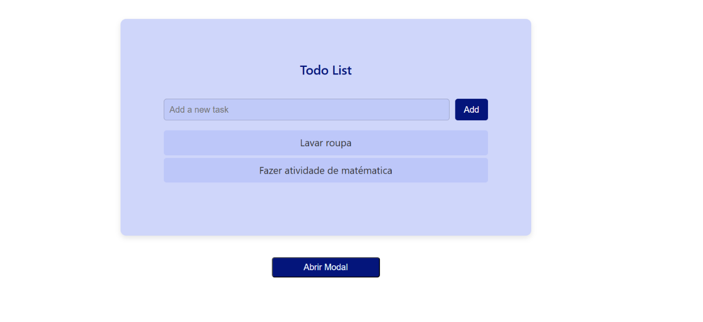

# ToDo List com janela modal

## Sobre
Projeto front-end em React para a criação de lista de tarefas com possibilidade de criar e excluir informações e de uma janela modal para envio de informações. O projeto foi criado para estudo de desenvolvimento em React e aprndizado da ccriação de janelas modais

## Preview

## Figma

