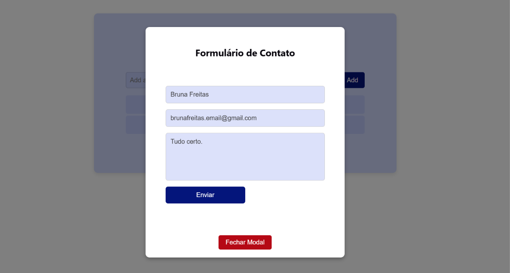

# ToDo List com janela modal

## Sobre
Projeto front-end em React para a criação de lista de tarefas e janela modal para envio de informações. O projeto foi criado para estudo de desenvolvimento em React e aprendizado da criação de janelas modais, portanto não tem salvamento de informações em um banco de dados mas há verificação de erros no momento de preenchimento do formulário.

Esse projeto também foi utilzado para aprendizado de como deployar projetos React no GitHub pages.

## Deploy no Github Pages
1.No terminal do seu projeto, instale a biblioteca como dependência de desenvolvimento: ``npm install gh-pages --save-dev``

- Resultado no **package.json**: ``"gh-pages": "^6.3.0",``

2.No **packege.json** adiciona
``
"scripts": {
    "predeploy":"npm run build",
    "deploy": "gh-pages -d dist"
  },
``

3.No arquivo **package.json** adiciona a linha ``"homepage": "https://nome-de-usuario.github.io/nome-do-repositorio",`` logo abaixo de **name**.

4.Em vit.config adiciona
``
export default defineConfig({
  base: "/nome-do-repositorio",
})
``
5.Sobe configurações para o github

6.Utilliza ``npm run deploy`` para rodar o deploy

## Preview




[]( https://brunasilva701.github.io/Bootcamp-Dio-Clone-Youtube/)

## Figma


[](https://www.figma.com/design/0XgQK0NT2NjJ30umywKWda/Todo-List---Formulario-Modal?node-id=0-1&p=f&t=4DikkQhsHif4QIQK-0)

## Comentarios para estudo
**1.Retirar essas linhas em ``root`` a pasta ``index.css`` permite que as linhas verticais que limitam a tela sejam removidas da tela.**
````
#root {
  border-inline: 1px solid var(--border);
  display: flex;
  flex-direction: column; 
}
````

**2.Ordenação de espaçamento**

``padding: 20px 0 25px 3px;``
- Topo (Top): 20px
- Direita (Right): 0 (nenhum espaçamento)
- Baixo (Bottom): 25px
- Esquerda (Left): 

``padding: 20px 30px;``
- 20px: Define o espaçamento para o topo e base (superior e inferior).
- 30px: Define o espaçamento para a esquerda e direita (laterais).